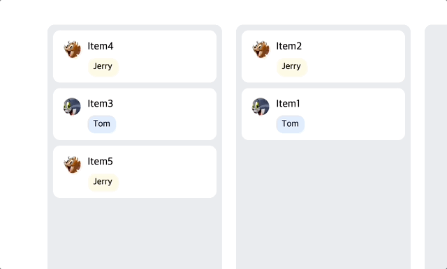

# 톰과 제리와 함께하는 드래그 놀이🐭🐱

이 프로젝트는 Webpack 설정을 직접 구성하고, 주어진 요구사항에 따라 동작하는 드래그 앤 드롭 기능을 구현하였습니다. `react-beautiful-dnd` 라이브러리를 사용하여, 지정된 드래그 제약 조건을 만족하는 애플리케이션을 만들었습니다. 사용자가 재미를 느낄만한 요소 또한 추가하였습니다.

## 진행 체크리스트

- [x] **Webpack 적용**: `react-scripts`를 사용하지 않고, Webpack을 직접 설정하여 React 애플리케이션을 구성하였습니다.
- [x] **Typescript 적용**: `Typescript`를 프로젝트 전반에 적용하여 개발 생산성을 높였습니다.
- [x] **칼럼 확장**: 기존의 한 칼럼에서 네 개의 칼럼으로 확장하였습니다.
- [x] **드래그 제약 조건 적용**: 드래그 제약 조건을 구현하여 드래그가 불가능 할 때에 스타일의 변화를 주었습니다.
- [x] **멀티 드래그 기능 구현**: 여러 아이템을 동시에 선택하고 드래그하는 기능을 추가했습니다.
- [x] **멀티 드래그시 드래그 제약 조건 적용**: 멀티 드래그 시에도 드래그 제약 규칙을 적용하였습니다.

### 드래그 제약 구현 결과

톰을 짝수 아이템으로, 제리를 홀수 아이템으로 취급하였습니다.

- 싱글 드래그 제약 구현

- 멀티 드래그 제약 구현

- 1번 컬럼에서 3번 컬럼 이동 제약
- 제리가 이동할 경우 3번 컬럼에서 톰이 나타납니다(유저의 재미를 위해 추가)

### 배포 url

[완성된 결과물 바로 보러가기](https://front-assignment-kimtaejin3s-projects.vercel.app/)
